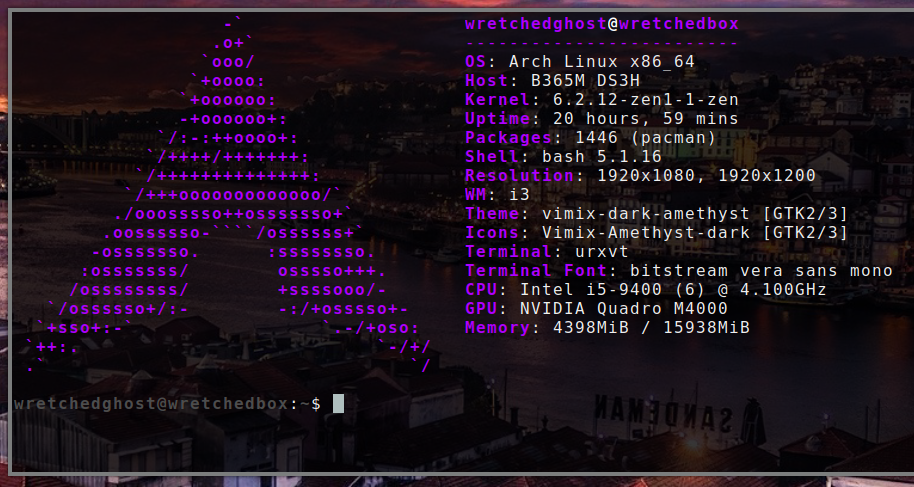
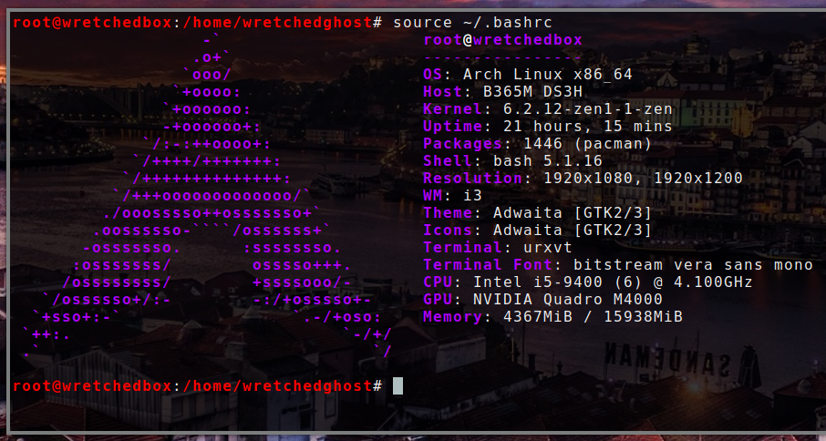

#### My .bashrc config

What my terminal looks like: 

To use: replace your ~/.bashrc and /root/.bashrc with the .bashrc file to have your terminal look like mine. 

What my terminal root looks like: 
